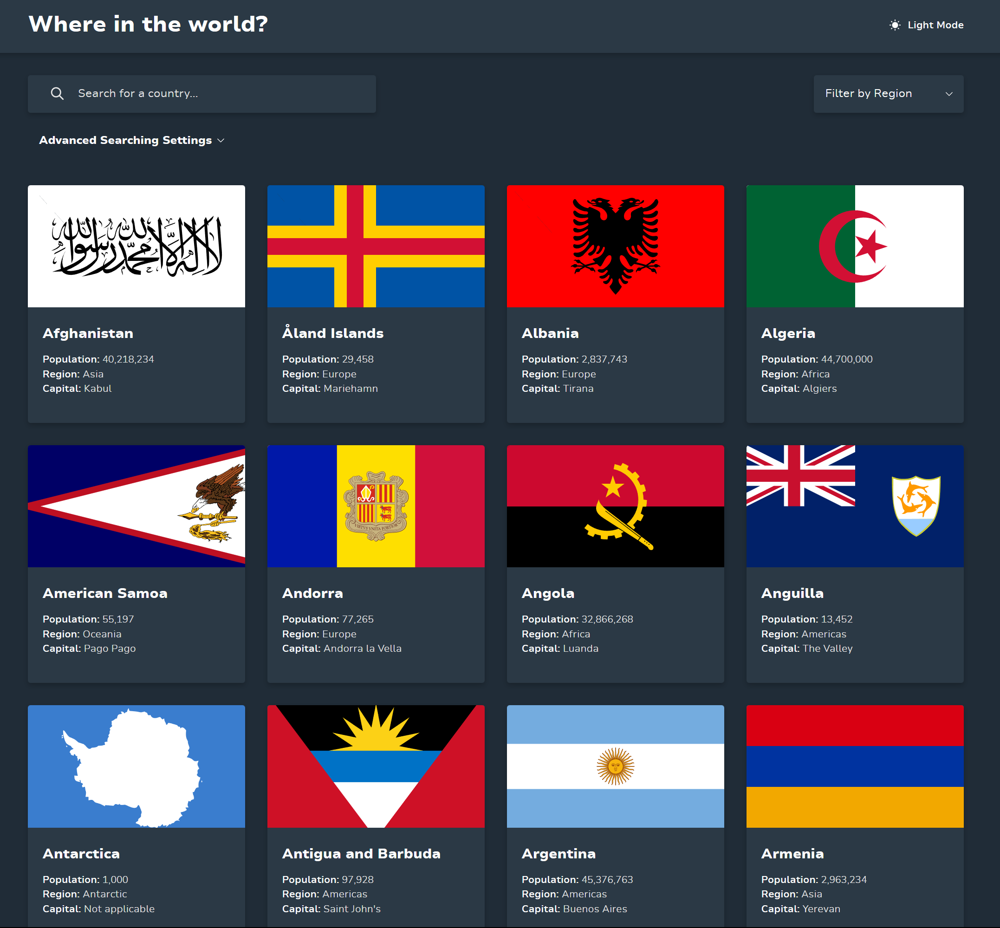
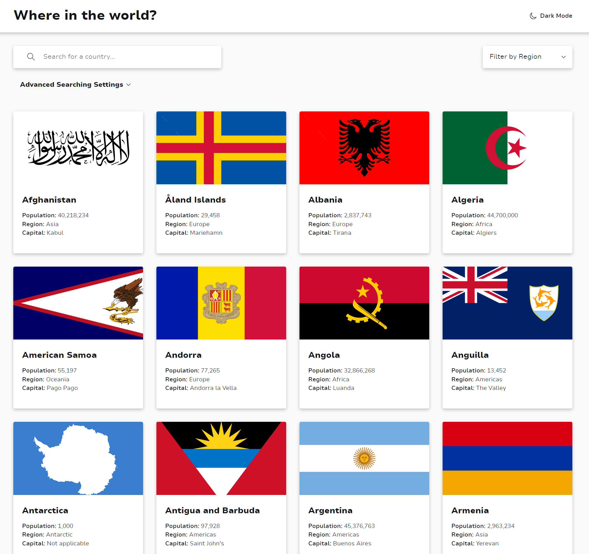
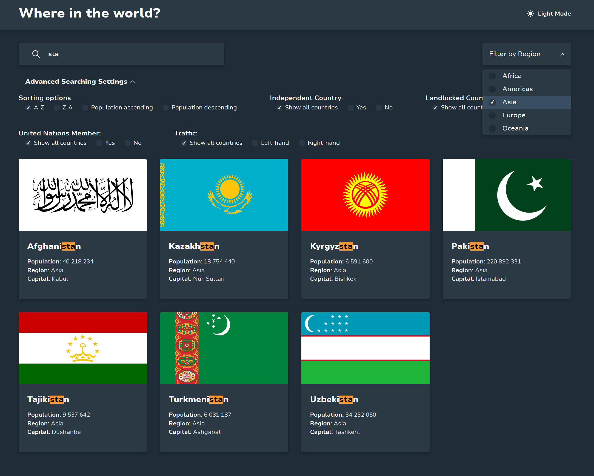
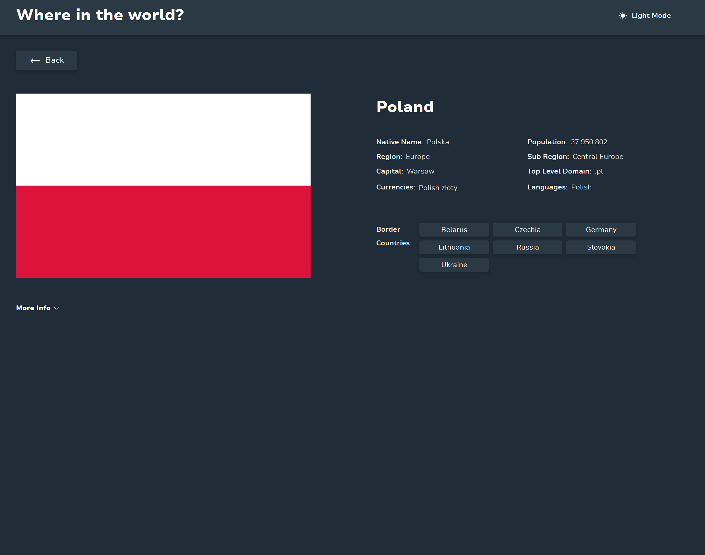
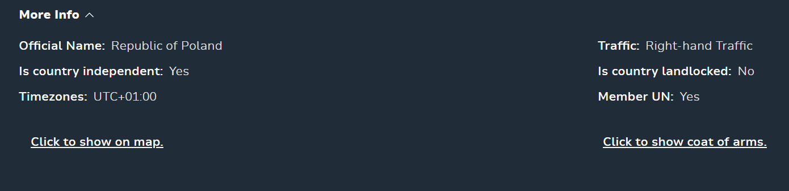
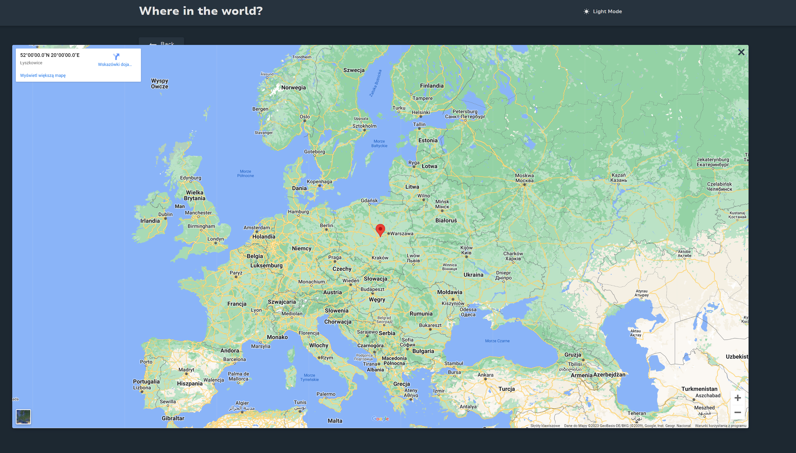
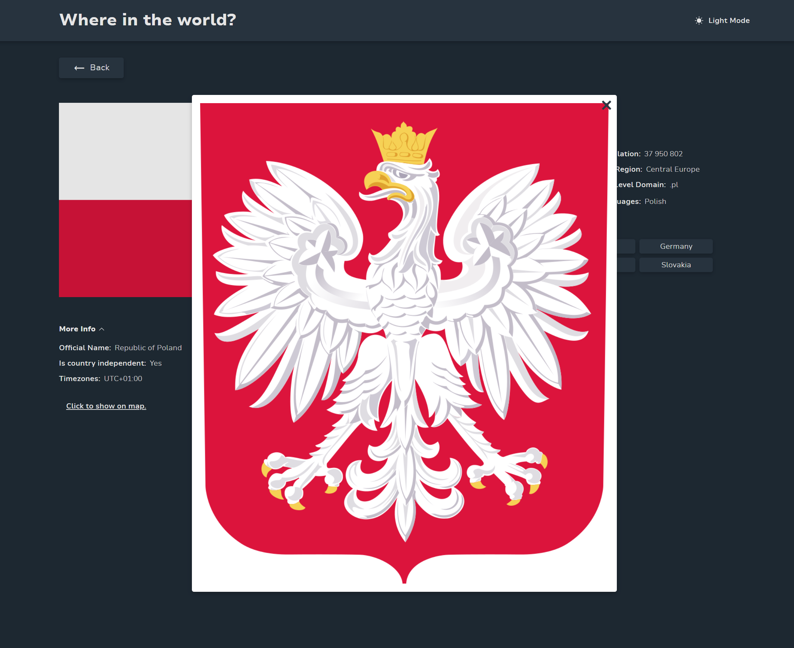
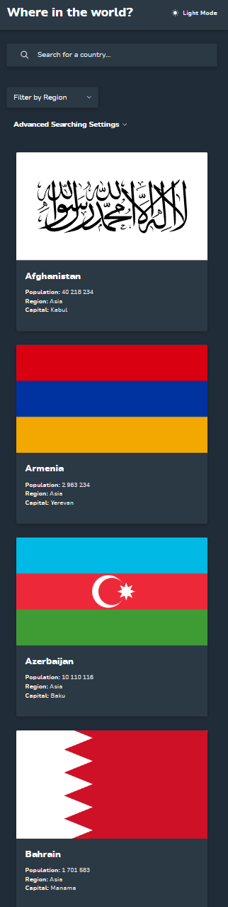

# Frontend Mentor - REST Countries API with advanced searching options and color theme switcher

[Link to the page](https://rest-api-countries-with-react.netlify.app/)

## Welcome! 👋

This is my first big project with React.

## Used Frameworks:

- React
- Sass

## Used Libraries:

- axios
- downshift (for accessible `select`)
- i18next (for translations)

**Build using Vite**

## How it is build:

I strongly focused on building semantically correct and accessible site. It's SEO optimized. Handled a lot of edge cases.

## How it works:

Website is integrated with the [REST Countries API](https://restcountries.com). Data is pulled with axios. While the data or images have not been loaded there are displayed loading spinners. Used language is based on language-detector(18 languages). If the language doesn't exist, English is as default.

Users is able to:

- See all countries from the API on the homepage
- Search for a country using an `input` field
- See marked searching phrase in matched countries names
- See warning if trying to type not allowed characters
- Filter countries by region/regions
- Expand advanced searching options
- Filter countries by advanced searching options
- See information that's nothing found if none of criteria match
- Click on a country to see more detailed information on a separate page
- Click to show more information on the detail page
- Click through to the border countries on the detail page
- Display [Google Map](https://www.google.pl/maps) to see country location on the map in more info tab
- Display coat of arms in more info tab
- Toggle the color scheme between light and dark mode

## Screenshots

